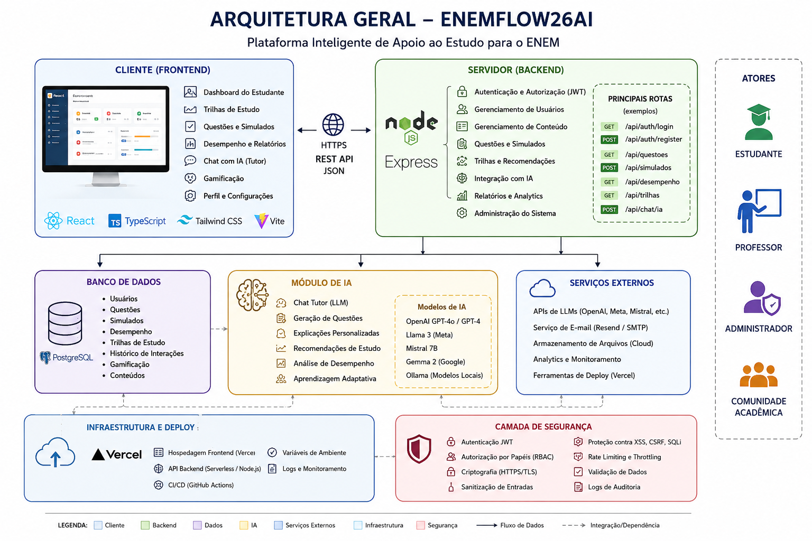

# Documentação Técnica e Avaliação do Projeto ENEMFlow26

## Repositório

Projeto analisado: ENEMFlow26

Autor: Kayky-Santos-17

Repositório oficial:
https://github.com/Kayky-Santos-17/enemflow26

Aplicação publicada:
https://enemflow26.vercel.app

---

# 1. Visão Geral do Projeto

O ENEMFlow26 é uma plataforma web voltada para apoio educacional e preparação acadêmica, com foco em estudantes que desejam se organizar para o ENEM e processos de aprendizagem relacionados ao ensino médio e pré-vestibular.

A estrutura do repositório demonstra um projeto full stack relativamente moderno, dividido em frontend e backend, utilizando tecnologias web amplamente adotadas no mercado de desenvolvimento.

O projeto apresenta características importantes de aplicações educacionais contemporâneas:

- Separação entre frontend e backend;
- Estrutura preparada para deploy em nuvem;
- Organização modular;
- Uso de JavaScript como linguagem principal;
- Integração com banco de dados;
- Possibilidade de escalabilidade futura;
- Aplicação hospedada na plataforma Vercel.

## Arquitetura Geral



---

# 2. Estrutura Técnica Identificada

A análise do repositório evidencia a seguinte organização:

## Estrutura de Diretórios

```
enemflow26/
 ├── backend/
 ├── frontend/
 ├── package.json
 ├── package-lock.json
 ├── vercel.json
 ├── check_db.js
 ├── testar-banco.js
 └── .gitignore
```

---

# 3. Tecnologias Utilizadas

Com base na estrutura do projeto, foram identificadas as seguintes tecnologias:

| Tecnologia | Finalidade |
|---|---|
| HTML | Estruturação das páginas |
| CSS | Estilização visual |
| JavaScript | Lógica da aplicação |
| Node.js | Backend da aplicação |
| Vercel | Hospedagem e deploy |
| Banco de Dados | Persistência de informações |
| JSON | Configuração e troca de dados |

---

# 4. Arquitetura do Sistema

O projeto segue um modelo clássico de arquitetura web cliente-servidor.

## Frontend

Responsável pela interface do usuário.

Funções principais:

- Exibição de conteúdo educacional;
- Navegação do estudante;
- Interação visual;
- Formulários;
- Controle da experiência do usuário;
- Possível gerenciamento de rotinas de estudo.

### Características positivas

- Estrutura separada do backend;
- Melhor manutenção;
- Facilidade de evolução;
- Potencial para responsividade.

---

## Backend

Responsável pelas regras de negócio e manipulação de dados.

Funções observadas:

- Comunicação com banco de dados;
- Controle lógico;
- Processamento de informações;
- Possível autenticação;
- Gerenciamento de conteúdo.

Os arquivos:

- `check_db.js`
- `testar-banco.js`

indicam preocupação com validação e testes da camada de persistência.

Isso demonstra maturidade inicial no desenvolvimento.

---

# 5. Características Acadêmicas do Software

O ENEMFlow26 possui potencial significativo como ferramenta de apoio acadêmico.

## 5.1 Organização dos Estudos

A plataforma pode auxiliar estudantes na:

- Organização de cronogramas;
- Planejamento de revisões;
- Controle de disciplinas;
- Gestão de metas;
- Acompanhamento de desempenho.

---

## 5.2 Apoio ao ENEM

A proposta pode contribuir para:

- Preparação direcionada ao ENEM;
- Estudos por áreas do conhecimento;
- Simulados;
- Revisões inteligentes;
- Controle de evolução do aluno.

---

## 5.3 Democratização do Ensino

Projetos open source educacionais possuem enorme relevância social.

O ENEMFlow26 pode ajudar:

- Estudantes de escolas públicas;
- Comunidades de baixa renda;
- Instituições federais;
- Projetos sociais;
- Pré-vestibulares comunitários.

A disponibilidade pública no GitHub permite:

- Reutilização do código;
- Aprendizado coletivo;
- Evolução comunitária;
- Contribuições colaborativas.

---

# 6. Importância para a Comunidade Acadêmica

O projeto possui relevância em múltiplas dimensões.

## 6.1 Como Ferramenta Educacional

Pode funcionar como:

- Plataforma de estudos;
- Ambiente de apoio pedagógico;
- Sistema complementar ao ensino;
- Ferramenta de autoaprendizagem.

---

## 6.2 Como Projeto de Pesquisa

O sistema pode ser utilizado em:

- Trabalhos de conclusão de curso;
- Pesquisas em educação digital;
- Estudos sobre aprendizagem adaptativa;
- Sistemas inteligentes educacionais;
- Engenharia de software educacional.

---

## 6.3 Como Base de Ensino em Computação

O repositório é útil para ensinar:

- Desenvolvimento web;
- Arquitetura full stack;
- Deploy em nuvem;
- Integração frontend/backend;
- Organização de projetos;
- Controle de versão com Git/GitHub.

---

# 7. Pontos Fortes do Projeto

## 7.1 Organização Estrutural

A separação frontend/backend demonstra boa prática de engenharia de software.

---

## 7.2 Uso de Tecnologias Modernas

O projeto utiliza ferramentas amplamente empregadas na indústria.

Isso facilita:

- Aprendizagem;
- Escalabilidade;
- Colaboração;
- Empregabilidade dos desenvolvedores.

---

## 7.3 Publicação em Produção

A presença de deploy público representa um diferencial importante.

Isso mostra:

- Capacidade de implantação;
- Conhecimento DevOps básico;
- Aplicação funcional;
- Visão prática de produto.

---

## 7.4 Potencial Open Source

Projetos educacionais abertos possuem grande valor acadêmico.

Eles incentivam:

- Colaboração;
- Compartilhamento de conhecimento;
- Desenvolvimento coletivo;
- Formação prática de estudantes.

---

# 8. Possíveis Melhorias Futuras

## 8.1 Documentação Técnica

O projeto pode evoluir significativamente com:

- README mais detalhado;
- Diagramas de arquitetura;
- Documentação de API;
- Guia de instalação;
- Manual do usuário.

---

## 8.2 Recursos Inteligentes

Possíveis evoluções:

- IA para recomendação de estudos;
- Chatbot educacional;
- Trilhas adaptativas;
- Análise de desempenho;
- Gamificação.

---

## 8.3 Escalabilidade

Melhorias arquiteturais futuras:

- Banco de dados mais robusto;
- API REST estruturada;
- Autenticação JWT;
- Docker;
- Monitoramento;
- Testes automatizados.

---

# 9. Possíveis Aplicações em Instituições de Ensino

O ENEMFlow26 pode ser utilizado em:

## Institutos Federais

- Apoio ao ensino médio integrado;
- Monitorias;
- Projetos de extensão.

---

## Universidades

- Laboratórios de desenvolvimento web;
- Pesquisa em EdTech;
- Projetos interdisciplinares.

---

## Escolas Públicas

- Reforço escolar;
- Preparação para vestibulares;
- Inclusão digital.

---

## Projetos Sociais

- Pré-ENEM comunitário;
- Educação popular;
- Inclusão educacional.

---

# 10. Avaliação Geral

O ENEMFlow26 representa um projeto acadêmico e tecnológico promissor.

Mesmo em estágio inicial, demonstra:

- Estrutura moderna;
- Organização adequada;
- Aplicação prática;
- Potencial social;
- Capacidade de expansão.

A iniciativa possui valor tanto para:

- Desenvolvimento educacional;
- Formação técnica;
- Comunidade open source;
- Pesquisa acadêmica;
- Inclusão digital.

---

# 11. Conclusão

O ENEMFlow26 é uma iniciativa relevante dentro do contexto de tecnologia educacional.

Sua arquitetura demonstra compreensão inicial de desenvolvimento full stack moderno, enquanto sua proposta possui impacto potencialmente positivo na democratização do acesso ao ensino.

O projeto pode evoluir para:

- Plataforma educacional inteligente;
- Ambiente de aprendizagem adaptativa;
- Ferramenta colaborativa acadêmica;
- Sistema de apoio ao ENEM;
- Laboratório de ensino de computação.

Além disso, o caráter open source amplia sua importância para a comunidade acadêmica, permitindo que estudantes, pesquisadores e desenvolvedores possam estudar, adaptar e contribuir com a plataforma.

---

# 12. Recomendações Estratégicas

## Curto Prazo

- Melhorar documentação;
- Adicionar screenshots;
- Criar README profissional;
- Descrever funcionalidades.

---

## Médio Prazo

- Implementar autenticação;
- Melhorar UI/UX;
- Adicionar analytics educacionais;
- Implementar dashboards.

---

## Longo Prazo

- Introduzir IA educacional;
- Criar sistema adaptativo;
- Implementar microserviços;
- Escalar para uso institucional.

---

# 13. Considerações Finais

Projetos como o ENEMFlow26 são importantes porque unem:

- Educação;
- Engenharia de software;
- Inclusão digital;
- Tecnologia social;
- Desenvolvimento acadêmico.

Esse tipo de iniciativa ajuda a fortalecer:

- Cultura open source;
- Formação de novos desenvolvedores;
- Democratização do conhecimento;
- Inovação educacional no Brasil.

